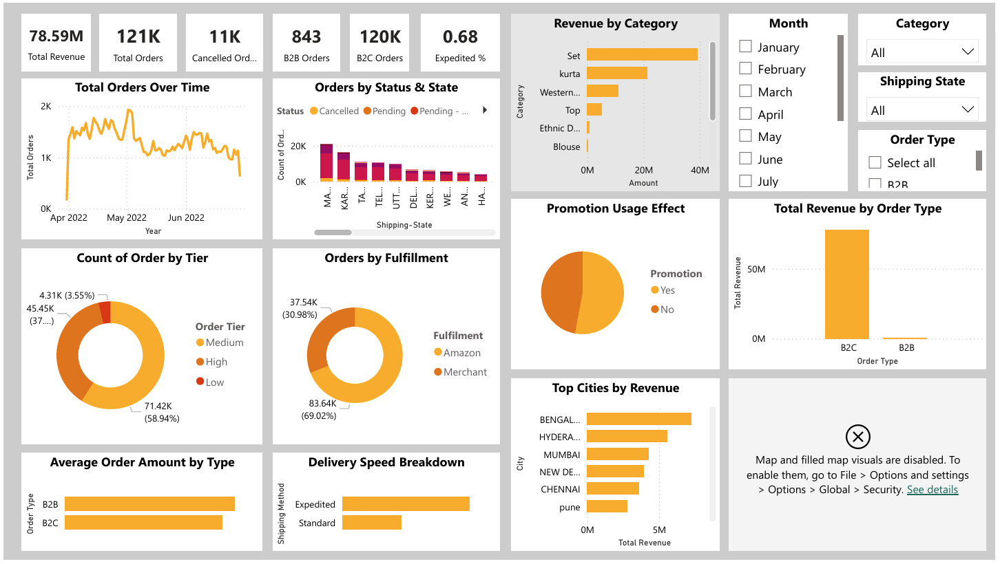

# Amazon Sales Dashboard – Power BI Report

## Project Overview
This Power BI dashboard provides a comprehensive analysis of Amazon sales data, capturing both B2B and B2C performance metrics across various product categories, time periods, fulfillment types, and geographic regions.

## Key Insights
- **Total Orders**: 121K
- **Total Revenue**: ₹78.59M
- **Cancelled Orders**: 11K
- **Order Types**:
  - B2C: 120K orders
  - B2B: 843 orders
- **Expedited Percentage**: 0.68%

## Dashboard Features
- **Time-Series Trends**: Visualizes monthly order trends from April to June 2022
- **Category Performance**: Revenue breakdown by product category, including top performers like "Set", "Kurta", and "Western" wear
- **Fulfillment Insights**: Comparison between Amazon-fulfilled (69.02%) and merchant-fulfilled (30.98%) orders
- **Geographical Analysis**:
  - Orders by state and city
  - Top revenue-generating cities: Bengaluru, Hyderabad, Mumbai, New Delhi, and Chennai
- **Order Status & Tier Breakdown**: 
  - Tracks pending, cancelled, and fulfilled orders by state
  - Distribution across Low (3.55%), Medium (58.94%), and High (37.51%) tiers
- **Delivery Speed & Promotions**:
  - Analysis of standard vs expedited shipping
  - Impact of promotions on order volume
- **Interactive Filters**: Month selection, category filtering, shipping state selection, and order type filters

## Tools & Technologies
- **Power BI Desktop**
- Data source embedded within the .pbix file

## Setup Instructions
1. Clone this repository
2. Open the .pbix file with Power BI Desktop
3. If prompted, update data source connections

## Screenshots

## License
[MIT License](LICENSE)

## Contact
For questions or feedback, please open an issue in this repository.
